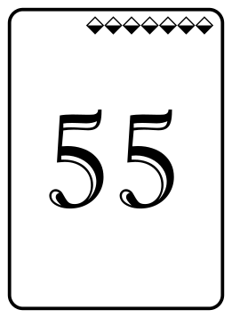
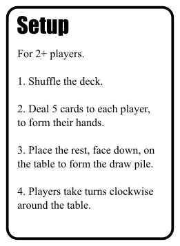

# CardMaker

A simple utility to make printable game cards from a [CSV](https://en.wikipedia.org/wiki/Comma-separated_values) spreadsheet, and some template SVGs.

This is meant for quickly prototyping game components (cards, tokens, etc.) when designing tabletop games.

Here are some samples that illustate what CardMaker can produce:




## Requirements

You will need these things:
- A recent version of [Python](https://python.org/) (tested with 3.8, but any 3+ should work).
- [Inkscape](https://inkscape.org/) (used for rendering SVG to PNG).
- A Windows, Mac, or Linux computer (tested on Mac and Windows).

## Installation

To install CardMaker, you can [download a zip](https://github.com/jminor/cardmaker/archive/master.zip) or use git from the command line:

```
% git clone https://github.com/jminor/cardmaker.git
% cd cardmaker
% python3 cardmaker.py --help
```

## Example

This repo includes a small example game called [All Your Base](http://www.dvorakgame.co.uk/index.php/All_Your_Base_deck) designed by [Kevan](http://www.dvorakgame.co.uk/index.php/User:Kevan) as part of the game [Dvorak](https://boardgamegeek.com/boardgame/9010/dvorak). That game is not part of this software, and may be subject to copyright.

Starting with [this spreadsheet](example/all_your_base.csv), and a couple of SVG templates, like [this one](example/action.svg), CardMaker will produce images like this:




(in [PNG](example/output/ALL%20YOUR%20BASE%20ARE%20BELONG%20TO%20US.png) and [SVG](example/output/ALL%20YOUR%20BASE%20ARE%20BELONG%20TO%20US.svg) formats)

To run CardMaker on the example, do this:

```
% cd cardmaker/example
% python3 ../cardmaker.py --data all_your_base.csv --output output/
```

*NOTE: Each time you run CardMaker, all of the output SVG and PNG images will be overwritten.*

## Spreadsheet

CardMaker reads card data from a [Comma-Separated Values (CSV)](https://en.wikipedia.org/wiki/Comma-separated_values) spreadsheet.

Your spreadsheet needs these columns:
- Card Name
- Template
- Copies
- Layers (optional)
- (Plus any other columns you want)

Each row in the spreadsheet will become a card output image.

The `Card Name` column defines the output filename (with a `.png` or `.svg` extension added).

The `Template` column determines which template SVG will be used for that card. You can use a single template for all your cards, or different ones for different types of cards. The example uses 4 templates for 4 types of outputs (rules, back, thing, action).

The `Copies` column determines how many copies of the identical image will be produced when printed. If more than one copy is output, duplicates will have `_2`, `_3`, etc. appended to their filename.

For details on the optional `Layers` column, see the [Layers](#Layers) section below.

Any other columns you include can be used to fill in the template SVG(s) you provide. If a column is not used in a template, it is ignored - so you can have loads of columns for other purposes.

There are many excellent spreadsheet programs that support reading & writing CSV files:
- [Google Sheets](https://sheets.google.com/)
- [Microsoft Excel](https://www.microsoft.com/en-us/microsoft-365/excel)
- [Apple Numbers](https://www.apple.com/numbers/)
- [LibreOffice Calc](https://libreoffice.org/)

You can also use a text editor like [Vim](https://www.vim.org/), [Visual Studio Code](https://code.visualstudio.com/), or whatever - just pay attention to your commas, and [CSV quoting syntax](https://en.wikipedia.org/wiki/Comma-separated_values).

## SVG Templates

CardMaker reads card templates from [Scalable Vector Graphics (SVG)](https://en.wikipedia.org/wiki/Scalable_Vector_Graphics) files.

CardMaker works best with SVG templates created in the free, Open Source, vector design program [Inkscape](https://inkscape.org/).

The SVG templates that you provide will be filled in with text from each row in your spreadsheet, and then rendered into output SVG and PNG files.

Each SVG template defines it's own page size, so you can use different templates for large or small cards, tokens, whole boards, or even cut-n-fold dice.

Text substitution is done with Python-style patterns like `{column}`.

Substitutions present in the content of a text element will be replaced.
In addition, text elements with an substitution patterns in their `id` will have
their content replaced.

For example, you might have an SVG text element with `NAME: {Card Name}` in it. The `{Card Name}` portion will be replaced with each card's name, as listed in the spreadsheet.

As a second example, you might have an SVG text elemnt with `A Long Example Name` in it, and an `id` of `{Card Name}`. The content of the text element will be replaced with each card's name, as listed in the spreadsheet. This can be helpful when you have long column names in short text elements, or vice versa.

Other columns can be used also. For example, a template might have `{Type}`, `{Cost}`, and/or `{Flavor Text}` in it, and you could have columns in your spreadsheet called "Type", "Cost", and "Flavor Text" with different values for each card. You can use whatever column names you want, as long as the names match up exactly (including matching capitalization).

If the column names are long, you can also use positional substitution to refer to the columns by number, starting with `{0}` for the 1st column, and then `{1}`, `{2}`, etc.

Substitution patterns can reference multiple columns, and include other text or punctuation. For example, you might have a template with `Combat: {ATT}/{DEF} {Bonus}` in it, and separate "ATT", "DEF", and "Bonus" columns in your spreadsheet.

Numbers and strings can be formatted according to the formatting rules in [PEP 3101](https://www.python.org/dev/peps/pep-3101/)

Any column in your spreadsheet can be used anywhere in your template. This can include simple text strings, colors, sizes, snippets of SVG code, or whatever. Keep in mind, however, that if you are creating your SVG template in an application like Inkscape, you may be limited by where you can put strings like `{whatever}` by the editor you are using. If this is problematic, you can always hand-edit the template SVGs in a text editor, to place the substitution patterns where you want them (e.g. for colors, etc.)

## Layers

You can make layers in your SVG Template that are shown or hidden based on an optional `Layers` column in your spreadsheet. This lets you toggle on/off overlays, logos, borders, or other elements in a single template instead of making several separate templates.

For this to work, you need to assign a name to each layer in Inkscape. For example:
- Border
- Bonus Icon (hidden)
- Main Text
- Underlay Image 1
- Underlay Image 2 (hidden)
- Large Logo (hidden)
- Background

The value in the `Layers` column must be a comma separated list of layer names, each with a `+` or `-` prefix indicating whether the layer should be made visible (`+`) or hidden (`-`).

For example:
- `+Bonus Icon`
- `-Underlay Image 1,+Underlay Image 2`
- `+Bonus Icon,+Underlay Image 2,-Underlay Image 1`
- `-Main Text,-Underlay Image 1,+Large Logo`

Note that the default visibility of each layer is important, since the `Layers` column will only turn on/off the layers mentioned. All other layers will be left as-is.

Also note, that the names of the layers much match exactly, including spaces and capitalization.

## Symbols & Images

You can use fonts with decorative symbols, like Wingdings, or Unicode symbols like these: ♠♥♦♣, ♔♕♖♗♘♙, and even emoji 😃😭😈🍜 (see: [Symbol Test](example/output/Symbol%20Test.png)). However, they will all be a single color, and your results may depend on which font or platform you are using.

If you are looking for SVG icons, then these are excellent resources:
- https://game-icons.net/
- https://thenounproject.com/

Images can be embedded in your SVG templates as well, but there is currently no support for replacing images, except via the Layer mechanism mentioned above. (See also the "Someday Maybe" below.)

## Text Layout: Long Text, Centering, etc.

CardMaker relies heavily on Inkscape's text formatting features for wrapping, alignment, etc.

You can use paragraph alignment settings to align text to the left, right, or center.

Long text will flow according to Inkscape's text layout rules. Use Inkscape's text tool, and adjust the size and position of the blue text flow bounds to control how text wraps. In some cases you may want to make the blue box extend past the edge of the card to avoid clipping.

## A Note About SVG Rendering

SVG is a very powerful and flexible format for Scalable Vector Graphics. There are many implementations of SVG rendering, many of which differ in some details.

As such, you may notice that the SVG templates, and SVG output files look different in your browser than they do in Inkscape, or in other programs. You may even notice differences with Inkscape on Mac vs Windows. This is especially true for multi-line wrapped text and/or font availability.

If you want your cards to look perfect, then I suggest that you use Inkscape to make your template (since CardMaker uses it for rendering) and then use a high resolution PNG output for printing.

## Output Sizes, DPI, etc.

The output size and DPI are determined by the template SVGs. CardMaker uses Inkscape's page area to determine the output region.

You can override the default dots-per-inch (DPI) with the `--dpi` command line argument. (The default is usually 96 dpi.) When cardmaker runs, it will print the exported resolution of each image to the console.

## Someday Maybe

Here are features that may someday be added. If you want to contribute to any of these features, pull requests are welcome :)

- Support for bold, italic, underline, and strikethrough text styles in substitutied text.
- Combining output images into grids for easy printing.
- Nesting/instancing of templates within templates (for SVG symbols/icons/images, etc.)
- Recursive substitution (e.g. `{Body Text}` -> `{tap}: Add {red_mana} to your mana pool.` -> text with inline symbols)
- These could be helpful for several of the features above:
  - https://github.com/astraw/svg_stack
  - https://github.com/btel/svg_utils
  - https://github.com/CrazyPython/svgmanip
- Support for [Affinity Designer](https://affinity.serif.com/en-us/designer/)
  - Experiments show that Affinity Designer's SVG support is not robust enough.
  - Exporting and re-importing an SVG results in many unwanted changes.
  - Text placement, alignment, etc. are messed up.
  - Affinity Designer has no batch or command line features.
  - Affinity Photo does have a batch feature, and could be used for rendering.
  - File format for sfdesigner files is unknown/proprietary.
- Support for [Sketch](https://www.sketch.com)
  - Documented file format: https://developer.sketch.com/file-format/
  - Documented command line tool for rendering: https://developer.sketch.com/cli/

